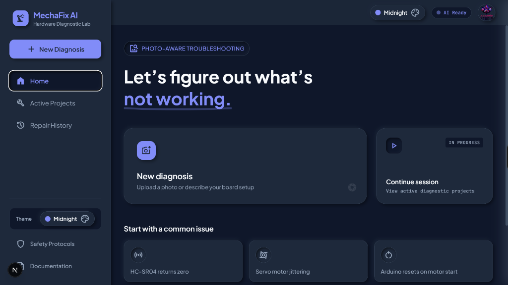
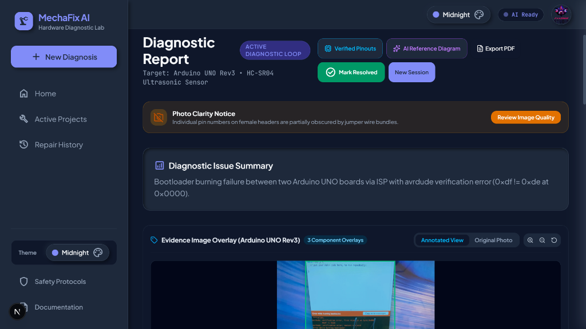
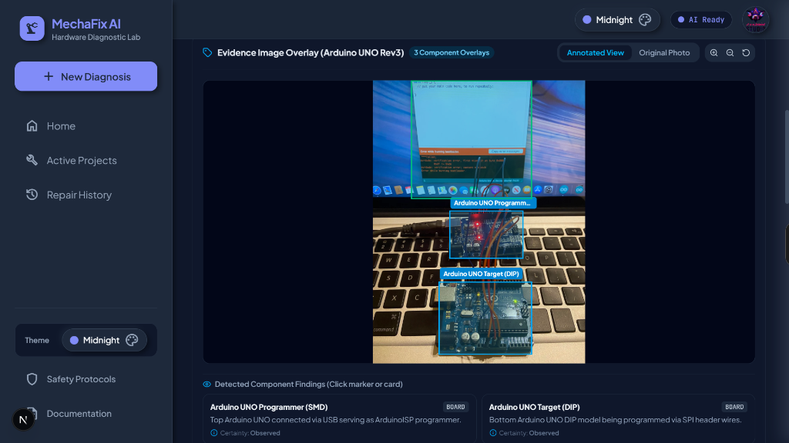
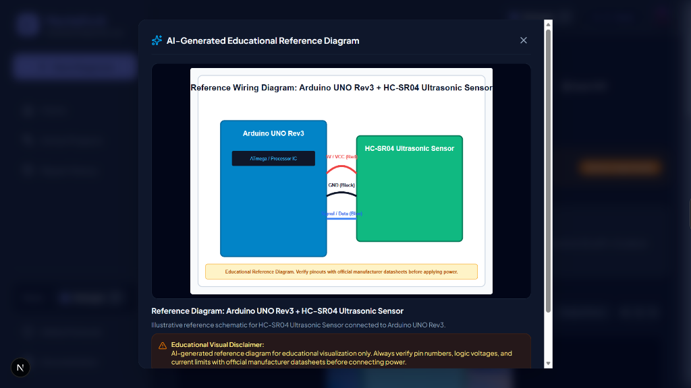
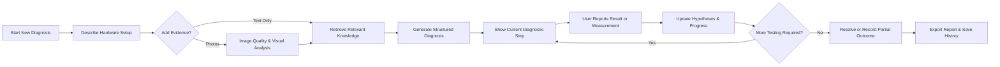
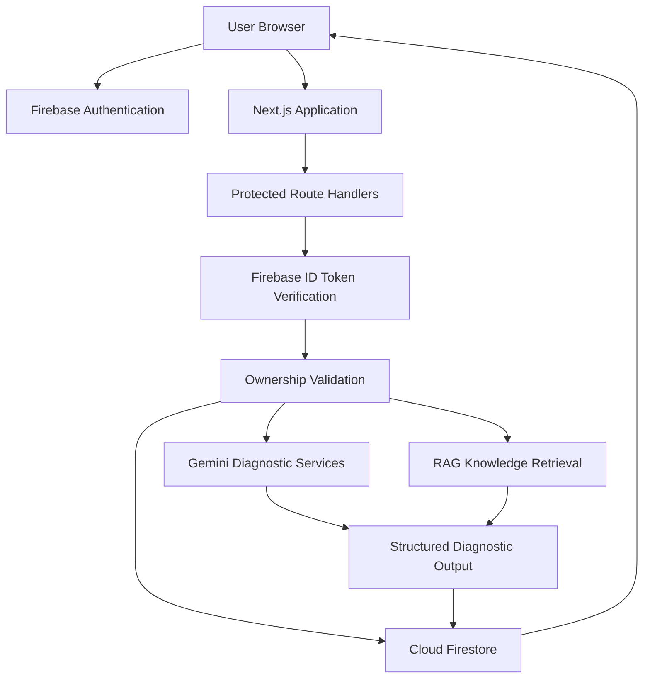

# MechaFix AI

MechaFix AI is an AI-assisted electronics and mechatronics troubleshooting platform that combines text and image understanding, guided diagnostic steps, verified hardware references, user-reported measurements, RAG-grounded knowledge retrieval, and repair documentation.

## Try MechaFix AI
- **Live Application:** [https://mecha-fix-ai.vercel.app](https://mecha-fix-ai.vercel.app)
- **Source Code:** [https://github.com/abdulwahidchohan/MechaFix_AI](https://github.com/abdulwahidchohan/MechaFix_AI)
- **Project Status:** Active Production System

---

## Application Preview

The interface uses a responsive hybrid-neumorphic dashboard designed for electronics and robotics troubleshooting. The screenshots below show the diagnosis entry point, active diagnostic workspace, annotated evidence, and AI-generated educational reference diagram.

### Diagnostic Dashboard



The dashboard provides a clear entry point for starting a new diagnosis, continuing an active session, reviewing repair history, selecting common hardware problem presets, opening safety guidance, and changing the visual theme.

### Active Diagnostic Workspace



The diagnostic workspace combines the issue summary, uploaded evidence, AI-assisted image annotations, image-quality feedback, guided test steps, hypothesis tracking, verified pinout references, measurements, follow-up assistance, and report export.

### AI-Assisted Image Annotations



Uploaded hardware photographs are analyzed by the multimodal AI to generate bounding box overlays for detected boards, sensors, drivers, and wiring regions, providing instant visual feedback on hardware components.

### AI-Generated Educational Reference Diagram



Reference diagrams are displayed separately from uploaded evidence. Every generated visual is marked as synthetic and educational, and users are instructed to verify pin numbers, voltage limits, component ratings, and connections against official documentation before applying power.

---

## How MechaFix AI Works

1. **Start a Diagnosis**  
   The user selects a board, component, power source, and problem category, then describes the expected and actual behavior. The user may begin with a text-only description, single photo, multiple photos, or a common preset.

2. **Add Visual Evidence**  
   Accepts multiple evidence images classified by purpose (circuit overview, power section, wiring close-up, component detail, error display) with automated quality validation.

3. **AI-Assisted Analysis**  
   The primary diagnosis model (`gemini-3.6-flash`) analyzes symptoms, hardware context, uploaded images, visible wiring, and user errors combined with RAG knowledge retrieval.

4. **Grounded Knowledge Retrieval**  
   Retrieves relevant information from 12 curated manuals using TF-IDF scoring and embeddings to ground diagnosis without hallucination.

5. **Guided Diagnostic Loop**  
   Presents one safe diagnostic step at a time with test instructions, safety notes, expected results, and optional measurement logging.

6. **Verified References and Educational Diagrams**  
   Access official pinouts, logic ratings, and generate synthetic educational wiring diagrams powered by `gemini-3.1-flash-image`.

7. **Resolve and Export**  
   Record resolution details, repair notes, archive sessions in Cloud Firestore, and export complete reports as PDF or Markdown.

---

## Visual Diagnostic Workflow



---

## Interface Guide

- **Dashboard**: New Diagnosis, Continue Session, Active Projects, Repair History, Issue Presets, Theme Selector, Safety Protocols, Documentation.
- **Diagnostic Report**: Session status, Target board/component, Photo clarity notice, Diagnostic issue summary, Original & annotated evidence, Current diagnostic step, Hypothesis summary, Diagnostic progress, Measurement logging, Verified pinouts, Follow-up assistant, PDF export.
- **Reference Diagram Modal**: Synthetic educational visual, Board/component context, Color-coded connections, Verification disclaimer, Safe error/refusal handling.

---

## Core Features

- Text-assisted & multi-image electronics diagnosis
- Image-quality assessment & annotated evidence overlays
- RAG-grounded troubleshooting context (12 manuals)
- Sequential diagnostic state machine with one-step-at-a-time flow
- User-reported voltage, current, resistance, continuity, and frequency measurement logging
- Ranked qualitative hypothesis tracking
- Verified pinout reference viewer (Arduino, ESP32, HC-SR04, L298N, DHT11)
- AI-generated educational reference diagrams (`gemini-3.1-flash-image`)
- Interactive follow-up assistant (`gemini-3.5-flash-lite`)
- Active project tracking & repair history archive
- Direct PDF and Markdown report exports
- Responsive hybrid-neumorphic design with 5 visual themes
- Firebase Authentication and Cloud Firestore persistence
- Strict safety guardrails for AC mains, swollen batteries, and burning hazards

---

## Understanding Visual Evidence

- **Original Photo**: A user-provided photograph of the real hardware setup.
- **Annotated Photo**: The original photograph with AI-generated overlays marking visible components, areas, warnings, or observations.
- **Reference Diagram**: A separate synthetic educational visual showing an illustrative schematic configuration.

> [!WARNING]
> A reference diagram is not observed evidence and does not prove that the user’s real circuit is wired correctly. Always verify pinouts, voltage limits, current limits, logic levels, and component variants against official manufacturer documentation before applying power.

---

## Five-Minute Demo

1. Open the [Live Application](https://mecha-fix-ai.vercel.app).
2. Sign in with Google.
3. Select the HC-SR04 preset or start a new diagnosis.
4. Enter the board, component, symptoms, expected behavior, and actual behavior.
5. Add one or more circuit photographs.
6. Start the diagnosis.
7. Review the issue summary and annotated evidence.
8. Perform the current diagnostic step.
9. Submit the result or log a multimeter measurement.
10. Review the updated hypotheses and next step.
11. Open Verified Pinouts.
12. Generate an AI educational reference diagram.
13. Ask a follow-up question in the assistant.
14. Mark the diagnosis resolved or partially resolved.
15. Export the report as PDF.

---

## Technical Architecture



### Technology Stack
- **Framework**: Next.js 15.5.22 (App Router)
- **UI & Logic**: React 19, TypeScript 5, Tailwind CSS 4
- **AI Integration**: `@google/genai` 2.13.0 (`gemini-3.6-flash`, `gemini-3.5-flash-lite`, `gemini-3.1-flash-image`)
- **Database & Security**: Firebase JS SDK & Firebase Admin SDK (Cloud Firestore with zero-trust security rules)
- **Reporting & Storage**: jsPDF, TF-IDF local RAG knowledge base

---

## Safety Notice

MechaFix AI is an educational troubleshooting assistant.

- Disconnect power before rewiring circuits.
- Never measure resistance or continuity on a powered circuit.
- Current measurement often requires changing multimeter lead position and placing the meter in series.
- Do not connect a meter configured for current measurement directly across a voltage source.
- Avoid mains-voltage (110V-240V AC) troubleshooting.
- Stop immediately if a battery is swollen, hot, leaking, smoking, or physically damaged.
- AI output may be incomplete or incorrect. Verify important specifications using official documentation.
- User-provided measurements are not independently verified by the AI.

---

## Installation & Local Development

Create `.env.local` based on `.env.example`:

```env
GEMINI_API_KEY="YOUR_GEMINI_API_KEY"
GEMINI_DIAGNOSIS_MODEL="gemini-3.6-flash"
GEMINI_FAST_MODEL="gemini-3.5-flash-lite"
GEMINI_IMAGE_MODEL="gemini-3.1-flash-image"
GEMINI_EMBEDDING_MODEL="gemini-embedding-2"
ENABLE_REFERENCE_DIAGRAMS="true"
RAG_MODE="tfidf"
```

Run validation & start server:

```bash
npm ci
npm run lint
npm run typecheck
npm run test
npm run build
npm run start
```

---

## User Guide & Documentation

For the full detailed user guide, screenshot breakdown, and troubleshooting manual index, see [`docs/USER_GUIDE.md`](./docs/USER_GUIDE.md).

---

## License

MIT License. Created by [Abdul Wahid Chohan](https://github.com/abdulwahidchohan).
