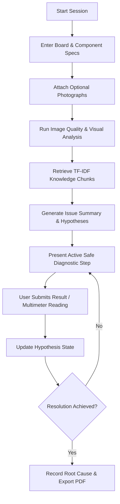

# MechaFix AI Complete User & Evaluator Guide

Welcome to the comprehensive guide for **MechaFix AI**, an AI-assisted electronics and mechatronics troubleshooting platform.

## Table of Contents
1. [Platform Overview](#platform-overview)
2. [Diagnostic Workflow Breakdown](#diagnostic-workflow-breakdown)
3. [Understanding Visual Evidence Types](#understanding-visual-evidence-types)
4. [Multimeter & Measurement Guidance](#multimeter--measurement-guidance)
5. [Educational Reference Diagrams](#educational-reference-diagrams)
6. [Report Export & History Archive](#report-export--history-archive)
7. [Electrical & Hardware Safety Rules](#electrical--hardware-safety-rules)

---

## Platform Overview

MechaFix AI combines multimodal AI model reasoning (**Gemini 3.6 Flash**), a local RAG knowledge pipeline (12 curated hardware manuals), verified component pinout definitions, and an interactive state machine to systematically isolate hardware failures in microcontroller and robotics projects.

---

## Diagnostic Workflow Breakdown

### 1. New Diagnosis Entry
Users can start a diagnosis by specifying:
- **Target Board**: Arduino UNO, ESP32, Raspberry Pi Pico, etc.
- **Target Component**: HC-SR04 Ultrasonic Sensor, L298N Motor Driver, DHT11, Servo, etc.
- **Power Source**: USB 5V, 9V Battery, External Bench Supply.
- **Problem Category**: Sensor Not Responding, Motor Not Turning, Reset Loop, Power Dip, etc.
- **Symptoms & Behavior**: Expected behavior vs actual observed behavior.

### 2. Photo Quality Validation
Uploaded photos undergo automatic clarity assessment. If wiring is obscured or lighting is dim, the application provides an **Image Quality Notice** while allowing smooth fallback to text-assisted diagnosis.

### 3. State Machine & Hypothesis Tracking
Each session maintains a list of ranked qualitative hypotheses:
- `suspected`: Initial potential root causes.
- `confirmed`: Verified by diagnostic tests or measurements.
- `ruled_out`: Eliminated through systematic steps.

---

## Understanding Visual Evidence Types

| Visual Type | Source | Purpose & Usage | Safety Distinction |
| :--- | :--- | :--- | :--- |
| **Original Photo** | User camera upload | Real physical hardware state | User's real physical circuit |
| **Annotated Photo** | Multimodal AI overlay | Marks detected ICs, pin regions, damaged components | Visual bounding boxes overlaying real photo |
| **Reference Diagram** | AI-generated synthetic visual | Educational illustrative wiring schematic | **Synthetic visual only**; not proof of current wiring |

> [!WARNING]
> Reference diagrams are strictly synthetic educational illustrations. Never assume a reference diagram reflects your real breadboard layout. Always verify pin numbers and voltage ratings against manufacturer datasheets before connecting power.

---

## Multimeter & Measurement Guidance

MechaFix AI allows users to log user-reported measurements during any diagnostic step:
- **Voltage (V)**: Measured across components or between power rail and GND in parallel.
- **Resistance (Ω)**: **Always disconnect power first!** Measured across unpowered resistors or components.
- **Current (mA/A)**: Measured in **series** with the load. Never place an ammeter across a voltage source!
- **Continuity / Short**: Unpowered check to verify zero-resistance connections or detect accidental solder bridges.

---

## Educational Reference Diagrams

When enabled (`ENABLE_REFERENCE_DIAGRAMS="true"`), users can click **AI Reference Diagram** to request an illustrative vector schematic powered by `gemini-3.1-flash-image`.

Reference diagrams:
- Are generated on-demand with lazy SDK initialization.
- Include explicit electrical safety disclaimers.
- Are rejected cleanly (`403 SAFETY_REFUSAL`) if high-voltage mains (110V/220V AC) or damaged batteries are detected.

---

## Report Export & History Archive

Completed or ongoing sessions can be:
- Exported to **PDF** using client-side jsPDF rendering.
- Downloaded or copied as standard **Markdown**.
- Archived in Cloud Firestore for future reference and comparison.

---

## Electrical & Hardware Safety Rules

1. **Disconnect Power**: Always disconnect power before making or changing wiring connections.
2. **No Power for Resistance Checks**: Never use a multimeter to measure resistance on a live circuit.
3. **No AC Mains**: MechaFix AI is strictly designed for low-voltage DC electronics (<30V). Do not use for 110V/220V AC mains troubleshooting.
4. **Thermal & Battery Hazards**: Stop immediately if any battery is swollen, smoking, leaking, or excessively hot.
